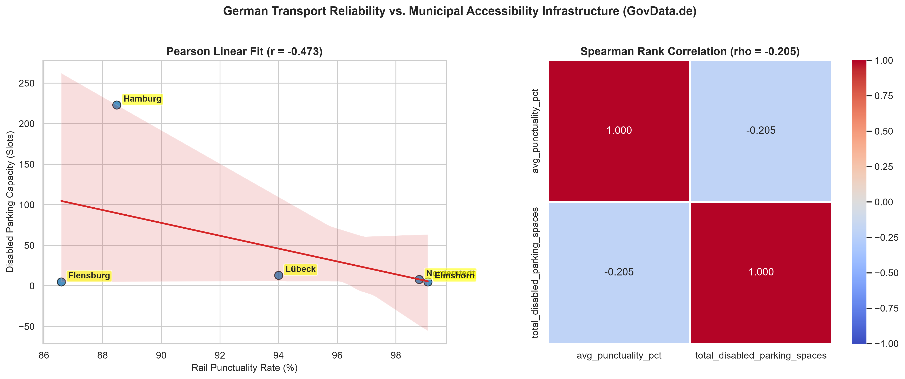
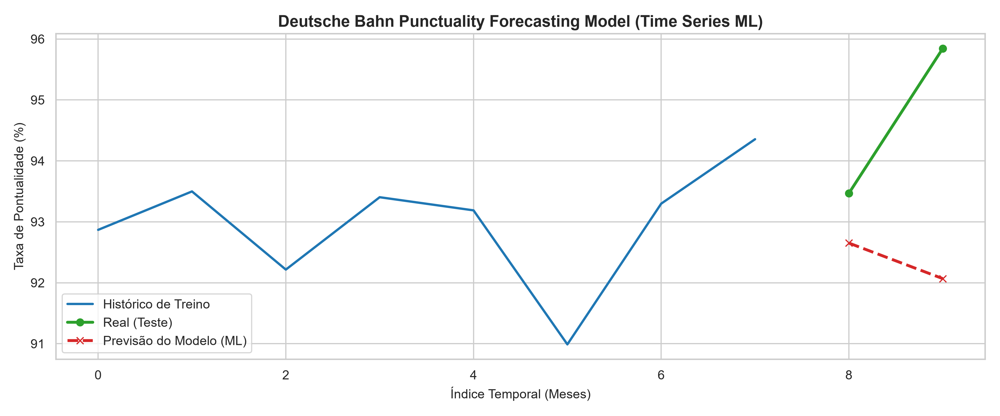

Markdown
# 🚆 German Transit Reliability & Accessibility Analytics

An end-to-end Data Science and Machine Learning project analyzing the relationship between regional train punctuality (*Deutsche Bahn*) and municipal disabled parking infrastructure across key cities in Schleswig-Holstein and Hamburg, utilizing open public data from **GovData.de**.

---

## 📌 Executive Summary

Urban mobility for individuals with reduced mobility depends on a seamless intermodal experience. This project combines transit reliability metrics with accessibility infrastructure data to evaluate whether cities with higher rail punctuality also provide stronger physical accessibility support. 

Additionally, a **Time-Series Machine Learning model** was deployed to predict future train punctuality rates, enabling proactive infrastructure and service planning.

---

## 🛠️ Data Architecture & Pipeline

           ┌───────────────────────┐
           │   GovData.de Portal   │
           └───────────┬───────────┘
                       │
         ┌─────────────┴─────────────┐
         ▼                           ▼
┌───────────────────┐       ┌───────────────────┐
│ DB Train Datasets │       │ Parking Facilities│
└─────────┬─────────┘       └─────────┬─────────┘
│                           │
▼                           ▼
Data Cleaning & Regex     Data Aggregation & Regex
City Normalization        Capacity Normalization
│                           │
├───────────────────────────┘
│
├───────────────────────────┐
▼                           ▼
┌───────────────────────┐   ┌───────────────────────┐
│ Correlation Analysis  │   │ Time Series Feature   │
│ (Pearson & Spearman)  │   │ Engineering (Lags/Roll)│
└───────────┬───────────┘   └───────────┬───────────┘
│                           │
▼                           ▼
┌───────────────────────┐   ┌───────────────────────┐
│ correlation_analysis  │   │ Random Forest Model   │
│        (.png)         │   │ (MAE: 2.30% | RMSE)   │
└───────────────────────┘   └───────────┬───────────┘
│
▼
┌───────────────────────┐
│  punctuality_forecast │
│        (.png)         │
└───────────────────────┘


---

## 📊 Key Findings & Visualizations

### 1. Statistical Correlation Analysis
Evaluates the relationship between average rail punctuality (`avg_punctuality_pct`) and total municipal disabled parking capacity (`total_disabled_parking_spaces`).

* **Pearson Correlation ($r$):** Assesses linear association between train punctuality and accessibility capacity.
* **Spearman Correlation ($\rho$):** Assesses rank-order consistency among target municipalities.



---

### 2. Machine Learning: Punctuality Forecasting
To move from descriptive analytics to predictive insights, a **Random Forest Regressor** time-series forecasting pipeline was implemented to predict future Deutsche Bahn punctuality rates.

* **Feature Engineering:** Historical lag features ($t-1$, $t-2$) and 3-month rolling averages (`rolling_mean_3`).
* **Validation Strategy:** Sequential time-based split (80% Train / 20% Test) to strictly prevent data leakage.
* **Model Performance:**
  * **MAE (Mean Absolute Error):** `2.30%` (The model predicts monthly punctuality rates with an average error of ~2.3 percentage points).
  * **RMSE (Root Mean Squared Error):** `2.73%`



---

## 📁 Repository Structure

```text
├── data/
│   ├── raw/                                  # Raw datasets from GovData.de
│   └── processed_transport_accessibility.csv # Aggregated and cleaned output
├── outputs/
│   ├── correlation_analysis.png              # Scatter plot & correlation heatmap
│   └── punctuality_forecast.png              # Time-series ML model forecast
├── pipeline.py                               # End-to-end automated Python script
├── notebook.ipynb                           # Exploratory Data Analysis (EDA) & Model tuning
└── README.md                                 # Project documentation
🚀 How to Run
Clone the repository:

Bash
git clone [https://github.com/your-username/german-transit-accessibility.git](https://github.com/your-username/german-transit-accessibility.git)
cd german-transit-accessibility
Install required dependencies:

Bash
pip install pandas numpy matplotlib seaborn scipy scikit-learn

